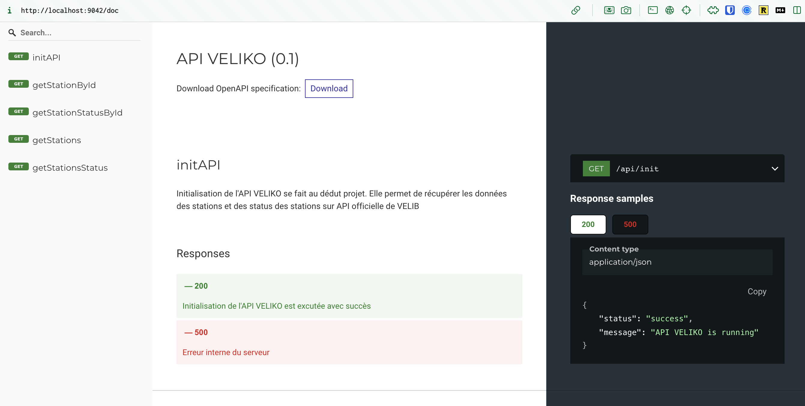

# Démarrer dans un projet

Si votre projet est dockerisé, vous pouvez intégrer le mock API directement dans votre projet.

## Installation

Ouvrez le fichier `docker-compose.yml` ou `compose.yml` de votre projet et ajoutez le service suivant dans la section "services" :

```yaml
services:
  mock-veliko-api:
    container_name: mock-veliko-api
    image: bfoujols/mock-veliko-api:latest
    ports:
      - "9042:80"
```

L'api est disponible sur le port 9042.

## Démarrer le mock API

Lancez la commande suivante à la racine de votre projet :

```bash
docker compose up -d
```

Le mock API est accessible à l'adresse suivante : [http://localhost:9042/doc](http://localhost:9042/doc)

<figure markdown="span">
  
</figure>